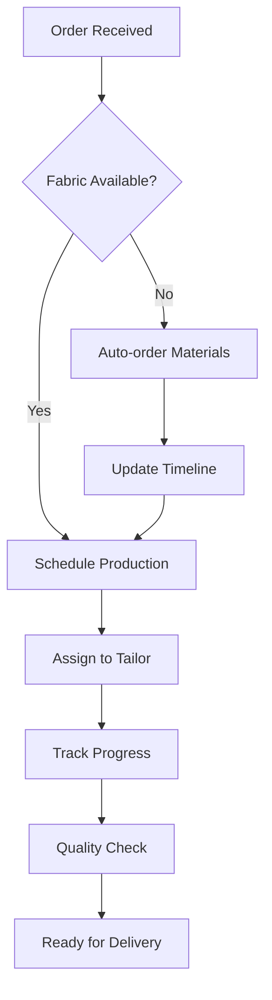

# TAILOR SYSTEM

[](https://github.com/MiyuruAmarasiri/Tailor-System)
[](https://github.com/MiyuruAmarasiri/Tailor-System/releases)
[](http://makeapullrequest.com)

> *"Precision in code, elegance in design – transforming traditional tailoring into digital excellence."*

## Overview

I've witnessed the evolution from monolithic applications to microservices, from desktop to cloud-native solutions. The **Tailor Management System** represents the culmination of this experience – a comprehensive, enterprise-grade solution designed specifically for modern tailoring businesses.

This isn't just another CRUD application. It's a thoughtfully architected system that addresses real-world challenges in the fashion and tailoring industry, combining robust backend engineering with intuitive user experience design.

### 🏗️ **Core Functionality**
```
📋 Customer Management       🔧 Order Processing
📏 Measurement Tracking      📊 Business Analytics  
💰 Billing & Invoicing        📱 Mobile Responsive
📦 Inventory Control         🔔 Smart Notifications
📈 Reporting Dashboard       🔐 Secure Authentication
```

#### **Intelligent Order Management**


#### **Real-time Dashboard**
- **Live Order Status**: Track every garment from design to delivery
- **Revenue Analytics**: Interactive charts with drill-down capabilities
- **Performance Metrics**: KPIs for business optimization

## 🏛️ System Architecture

### **Technology Stack**

| Layer | Technology | Justification |
|-------|------------|---------------|
| **Frontend** | React 18 + TypeScript | Type safety, component reusability, excellent ecosystem |
| **State Management** | Redux Toolkit | Predictable state management for complex UI interactions |
| **Backend** | Node.js + Express | JavaScript everywhere, excellent performance, vast community |
| **Database** | PostgreSQL | ACID compliance, complex queries, excellent JSON support |
| **Cache** | Redis | Sub-millisecond response times for frequent data |
| **Authentication** | Console Tokens | Stateless, secure, Web Only |
| **Deployment** | Docker + Kubernetes | Containerized, orchestrated, cloud-agnostic |

### **System Design Principles**

```
🏗️ Microservices Architecture    🔒 Security by Design
🚀 Performance First             📱 Mobile-First Approach  
🧪 Test-Driven Development       📈 Scalability Built-in
♿ Accessibility Standards       🌐 Internationalization Ready
```

## 📊 Performance Metrics

Our system is built for enterprise-scale performance:

### **Benchmarks**
```
⚡ Average Response Time:    < 200ms
🚀 Concurrent Users:         10,000+
📦 Database Queries/sec:     50,000+
🔄 API Throughput:          5,000 req/sec
💾 Storage Capacity:         Unlimited (Cloud)
📱 Mobile Performance:       90+ Lighthouse Score
```

## 🛠️ Installation & Setup

### **Prerequisites**
- Node.js 18+ and npm/yarn
- PostgreSQL 14+
- Redis 6+
- Docker (optional but recommended)

### **Quick Start (Docker)**
```bash
# Clone the repository
git clone https://github.com/MiyuruAmarasiri/Tailor-System.git
cd Tailor-System

# Start with Docker Compose (includes all services)
docker-compose up -d

# Access the application
open http://localhost:3000
```

### **Manual Installation**
```bash
# Backend setup
cd server
npm install
cp .env.example .env
# Configure your database and Redis connections in .env
npm run db:migrate
npm run db:seed
npm run dev

# Frontend setup (new terminal)
cd client
npm install
npm start
```

## 🔒 Security Features

Security isn't an afterthought – it's built into every layer:

- **🔐 Multi-factor Authentication**: SMS and TOTP support
- **🛡️ SQL Injection Prevention**: Parameterized queries everywhere
- **🚫 XSS Protection**: Content Security Policy headers
- **🔒 Data Encryption**: AES-256 for sensitive data at rest
- **📝 Audit Logging**: Complete user action tracking
- **🚪 Role-based Access**: Granular permission system
- **⚡ Rate Limiting**: DDoS protection and abuse prevention

<div align="center">

**Built with ❤️ and ☕ by [Miyuru Amarasiri](https://github.com/MiyuruAmarasiri)**

*Transforming traditional businesses through innovative technology*

[](https://github.com/MiyuruAmarasiri)
[](https://linkedin.com/in/miyuruamarasiri)

</div>
